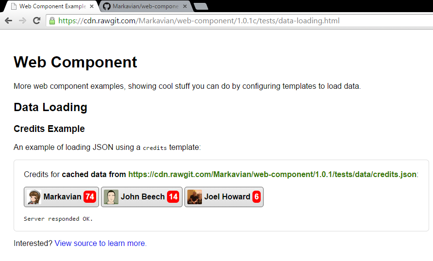

Web Component JS
================
A javascript library for very simply adding data driven web components to a HTML page, by defining your own domain specific, HTML language via templates.

Recent Releases

**Version 1.2.5** (In testing)
July 11th 2015
* https://cdn.rawgit.com/connected-web/web-component-js/1.2.5/lib/web-component.js

**Version 1.2.4** (Stable, supports loading of its own dependencies)
July 6th 2015
* https://cdn.rawgit.com/connected-web/web-component-js/1.2.4/lib/web-component.js

**Version 1.2.0** (Seems stable, old style depdendency errors)
30th June 2015
* https://cdn.rawgit.com/connected-web/web-component-js/1.2.0/lib/web-component.js

Dependencies
------------
- [jQuery](https://jquery.com/) - for remote calls to server to provide components with data
- [Handlebars](http://handlebarsjs.com/) - for "minimal templating on steroids"

What it can do
--------------
Web Component is a javascript library that can convert custom HTML tags, like in this example...


... into rendered content, using client side JavaScript, and template definitions:



Online Demos
------------
* `index.html` : [Web Component JS - Index of Examples](https://cdn.rawgit.com/connected-web/web-component-js/1.2.5/tests/index.html)

Tools
-----
Web Component JS Composer - with Live Editor and JS Packager:
* `tools/composer.html` [Web Component Composer for Creating File Includes](https://cdn.rawgit.com/connected-web/web-component-js/1.2.5/tools/composer.html)

The composer is a great way to play around with new templates and view the results in the live window. It also packs up your script, template and style tags into a JS packaged format which you can distribute via CDN or include by reference into local web pages.

### Sample Data
Some example JSON data to help with the examples:
* `data/credits.json` : [Github Credits](https://cdn.rawgit.com/connected-web/web-component-js/1.2.5/tests/data/credits.json)
* `data/geoNames.json` : [Geo Names](https://cdn.rawgit.com/connected-web/web-component-js/1.2.5/tests/data/geoNames.json)
* `data/monitorStatus.json` : [Monitor Status](https://cdn.rawgit.com/connected-web/web-component-js/1.2.5/tests/data/monitorStatus.json)
* `data/navigation.json` : [Navigation for Examples](https://cdn.rawgit.com/connected-web/web-component-js/1.2.5/tests/data/navigation.json)

Using Web Component JS
----------------------
1. Copy script tags for Web Component JS into the `<head></head>` of your HTML page
2. Define a `<template for="your-custom-element"></template>` tag
3. Insert your custom tags into the page
4. Load the page in a web browser to see your custom tags render

A complete example to get you started:
```html
<!DOCTYPE html>
<html>
<head>
  <title>Web Component Examples - Index</title>
  <script src="https://cdn.rawgit.com/connected-web/web-component-js/1.2.5/lib/web-component.js"></script>

  <style for="page">
    body { padding: 20px; font-family: sans-serif; }
  </style>

</head>
<body>
  <github-repo user="Markavian" repo="web-component"></github-repo>
  <github-repo user="johnbeech" repo="product-monitor"></github-repo>

  <template for="github-repo">
    <h2>Repository</h2>
    <li>
      <a href="https://github.com/{{user}}/{{repo}}/">
        <b>{{user}}</b>/<b>{{repo}}</b>
      </a>
    </li>
  </template>
</body>
</html>
```

Beyond this simple example, Web Component can be used for auto-loading data via jQuery AJAX calls, and re-rendering other components defined by your page template based on these events.

Projects using Web Component
----------------------------
* [Product Monitor](https://github.com/johnbeech/product-monitor/) - for rendering pretty much everything client side.

Local development setup
-------------------
```
npm install http-server -g
http-server
```
Then open http://localhost:8080 in a web-browser of your choice.

Edits can be made to `lib/web-component.js` directly, and you can use the HTML files in `tests/` as harnesses for various situations. Preferred browser for debugging is Chrome.

Web Component Wiki
------------------

Please see the wiki for documentation and examples on using the Web Component library and extending custom components with your own javascript.
* [Web Component API] (https://github.com/Markavian/web-component/wiki/Web-Component-API)

Changelog
---------
### Unreleased changes
* Work in progress compiler for `*.component.html` files
* Usage:
```js
var compiler = require('../web-component-js').compiler;
compiler.compile('lib', 'dist');
```

### 1.2.5
11th July 2015
* Allowed element properties to be re-read into the component instance just before a data request is made
* Added Modify Properties example page to demonstrate dynamically changing element properties on the fly
* Fix for Component.configure('UPPERCASE-TAGNAME') creating an invalid lookup when using `element.tagName` as the source data.

### 1.2.4
6th July 2015
* Updated examples and created tools folder for composer
* Template tags are now removed from the page when the DOM is scanned

### 1.2.3
2nd July 2015
* Added NPM support and started work on compiler

### 1.2.2
30th June 2015
* Added the self-resolving dependency script from the Composer to web-component.js
* Changed project location to https://github.com/connected-web/web-component-js/
* Improved handling of decoded templates to occur at an appropriate time

### 1.2.0
27th June 2015
* Added Web Component Composer
* Added file encoding and decoding to `web-component.js`
* Added events to ComponentClass model
* Rewired `dataSourceMessage` to be set based on events
* Documented event types with examples
* Deprecated `preRenderStep()` in favour of `ComponentClass.on('preRenderStep', function(instance) { ... });`
* Added `ComponentClass.registeredComponents` list, enabling `ComponentClass.apply(function(instance) { ... })`

### 1.1.2
22nd June 2015
* Moved jQuery data loading into an adapter
* Created `ComponentDataSources` class to hold data adapters
* Added `ComponentDataSources.register` method to allow new data adapters to be registered

### 1.1.1
16th June 2015
* Fix for broken `<template for="element-name">` component registration.
* Deprecated `<template tagName="element-name">` in favour of `<template for="element-name">`
* Changed default dataSourceType value to `false` from `jsonp`
* Fixed nested component memory-leak (Issue #1)
* Added log levels OFF, WARN, INFO, and RENDER
* Styled up example pages in Online Demos section
* Added styles to credits
* Created change log

### 1.1.0 (Yanked)
* Did not scan correctly for templates in the form `<template for="element-name">`

### 1.0.1
12th June 2015
* Added fail message to data loading based on jQuery spec.

### 1.0 (Newborn)
11th June 2015
* Changed example data into JSON format.
* Statically linked data to CDN.
* Added basic examples and data-loading example.
* Created static HTML template for testing out web-component.js
* Extracted component.js from [product-monitor](https://github.com/connected-web/product-monitor) project to make web-component.js.
* Initial commit
